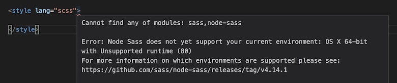
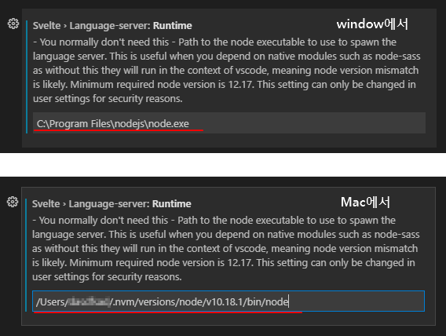

[](https://app.netlify.com/sites/cloning-trello-ohminkwon/deploys)

# Svelte Trello clone 프로젝트

[Svelte.js](https://svelte.dev)를 사용하는 Trello 클론 프로젝트입니다.<br>

<u>**[DEMO](https://cloning-trello-ohminkwon.netlify.app)**</u>


## 기본 Svelte template(Rollup) 프로젝트 생성

```bash
# 원하는 경로에 접근
$ cd Desktop

# 프로젝트 생성
# npx degit sveltejs/template 프로젝트(폴더)_이름
$ npx degit sveltejs/template svelte-trello-app

# 생성한 프로젝트로 들어가기
$ cd svelte-trello-app

# 프로젝트 VSCode에서 열기(아래 명령이 동작하지 않으면 수동으로 열어주세요)
$ code .
```

## 기본 패키지

- @rollup/plugin-commonjs: CommonJS 모듈을 ES6로 변환합니다.(15버전을 사용합니다)
- @rollup/plugin-node-resolve: `node_modules`에서 써드파티 모듈을 사용하기 위해 필요합니다.(9버전을 사용합니다)
- rollup: 프로젝트를 번들링하는 핵심 패키지입니다.
- rollup-plugin-livereload: 실시간 Reload 서버를 사용합니다.
- rollup-plugin-svelte: Svelte 싱글 파일 컴포넌트(SFC)를 컴파일합니다.
- rollup-plugin-terser: 컴파일 결과를 압축해 더 작은 번들 결과를 만들 수 있습니다.
- svelte: SvelteJS 핵심 패키지입니다.
- sirv-cli: SPA 서버를 실행합니다.

기본 패키지를 다음과 같이 업데이트하세요.

```bash
$ npm i -D svelte@^3 @rollup/plugin-commonjs@^15 @rollup/plugin-node-resolve@^9
```

## 추가 패키지  

- @rollup/plugin-alias: 경로 별칭을 사용해 더 편리하게 모듈을 가져올 수 있습니다.
- @rollup/plugin-json: json 파일의 데이터를 편리하게 불러올 수 있습니다.
- @rollup/plugin-strip: 배포용 제품은(개발 모드가 아닐 때) `console.log` 같은 Console 명령을 제거하는 것이 좋습니다.
- rollup-plugin-node-builtins: Node 내장 API를 사용할 수 있습니다.
- rollup-plugin-node-globals: 일부 Node 모듈이 필요로 하는 전역 API를 사용할 수 있습니다.
- rollup-plugin-replace: 번들 파일의 문자를 대체합니다. 문제가 발생하는 코드를 다른 코드(코드)로 대체 실행하기 위해 사용합니다.
- svelte-preprocess: PostCSS(Autoprefixer), SCSS, TypeScript 등을 지원하는 Svelte 전 처리기입니다.
- autoprefixer: CSS에 자동으로 공급 업체 접두사(Vendor prefix)를 적용합니다.(9버전을 사용하면 내부에서 postcss를 설치합니다, 10버전 이상은 postcss를 별도 설치해야 합니다)
- ~~node-sass: SCSS를 CSS로 컴파일합니다.~~
- sass, sass-loader: node-sass와 같은 역할을 합니다.
- crypto-random-string: ID로 사용할 고유한 랜덤 문자열을 생성합니다.
- sortablejs: Drag and Drop으로 목록을 쉽게 정렬할 수 있습니다.
- lodash: 다양한 유틸리티 기능을 제공하는 자바스크립트 라이브러리입니다.

추가 패키지를 다음과 같이 한번에 설치할 수 있습니다.<br />

## 확인하세요!

### node-sass

Svelte `<style>`에서 SCSS를 사용할 때 <br />
`node-sass`를 설치해도 VS Code에서 다음과 같은 에러가 발생할 수 있습니다.

```error
Cannot find any of modules: sass,node-sass ...
```



확장 프로그램 **Svelte for VS Code**의 extension setting에서<br />
`Svelte > Language-server:Runtime` 항목에 다음과 같이 node 경로를 추가하세요.



node 경로는 터미널에서 다음과 같이 입력해 확인할 수 있습니다.

```bash
# for Mac
$ which node

# for Windows
$ where node
``` 

### sass, sass-loader

netlify에서 디플로이먼트 방식의 변경으로 node-sass 모듈을 적용할 때 <br />
디플로이 과정에서 에러가 발생할 수 있습니다.

sass와 sass-loader 모듈을 통해 node-sass 모듈 역할을 대체 할 수 있습니다.

```bash
npm i -D sass sass-loader
```

